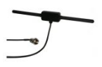

============
Chapter
============

Lorem ipsum dolor sit amet, consectetur adipiscing elit. Sed condimentum nulla vel neque venenatis,
nec placerat lorem placerat. Cras purus eros, gravida vitae tincidunt id, vehicula nec nulla.
Fusce aliquet auctor cursus. Phasellus ex neque, vestibulum non est vitae, viverra fringilla tortor.

Special Cases
-------------

Tables
^^^^^^

Unable to use tables with word wrapping in Sphinx and RTD. Therefore, a stylesheet is added for overriding table width restrictions.

.. |longtext| replace:: this is a longish text to include within a table and which is longer than the width of the column. longer than the width of the column.

.. list-table:: This is a list table with images in it.
	:widths: 1 2

	* 	- .. figure:: ../img/at-dipole.png
			:figwidth: 50px

		- This is a long caption for a figure. Lorem ipsum dolor sit amet, consectetur adipiscing elit.
		  Donec porttitor dolor in odio posuere, vitae ornare libero mattis. In lobortis justo vestibulum nibh aliquet, non.
		
		
	* 	- |dipole|
		- |longtext|

		

.. tip::	For more information about Paragraph Level Markup:
            `Have a look here <https://rtd-sphinx-theme.readthedocs.io/en/latest/demo/demo.html>`_.
